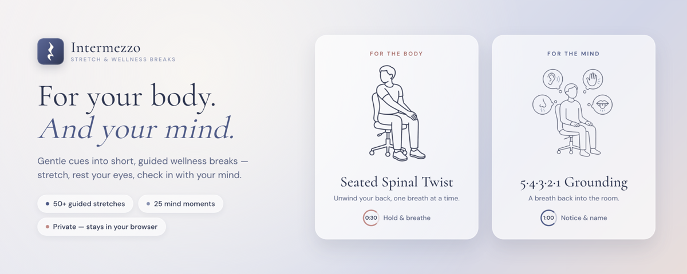
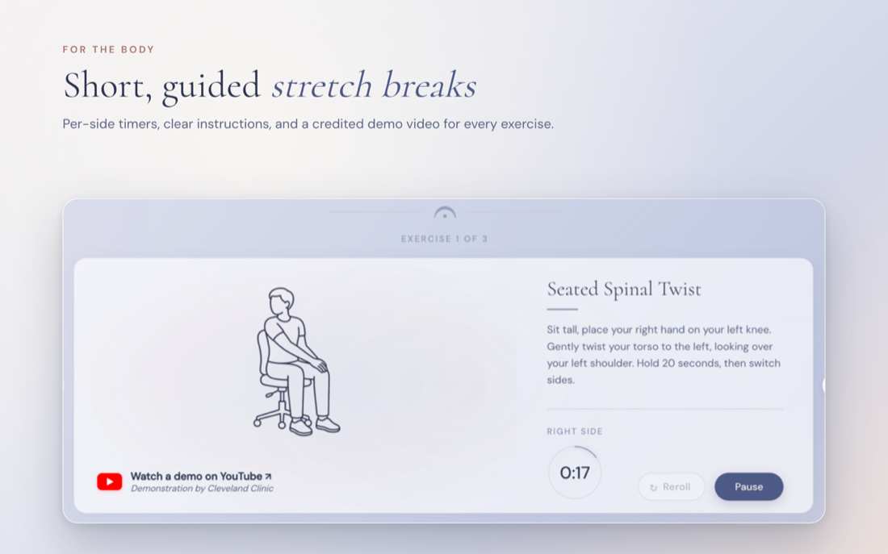
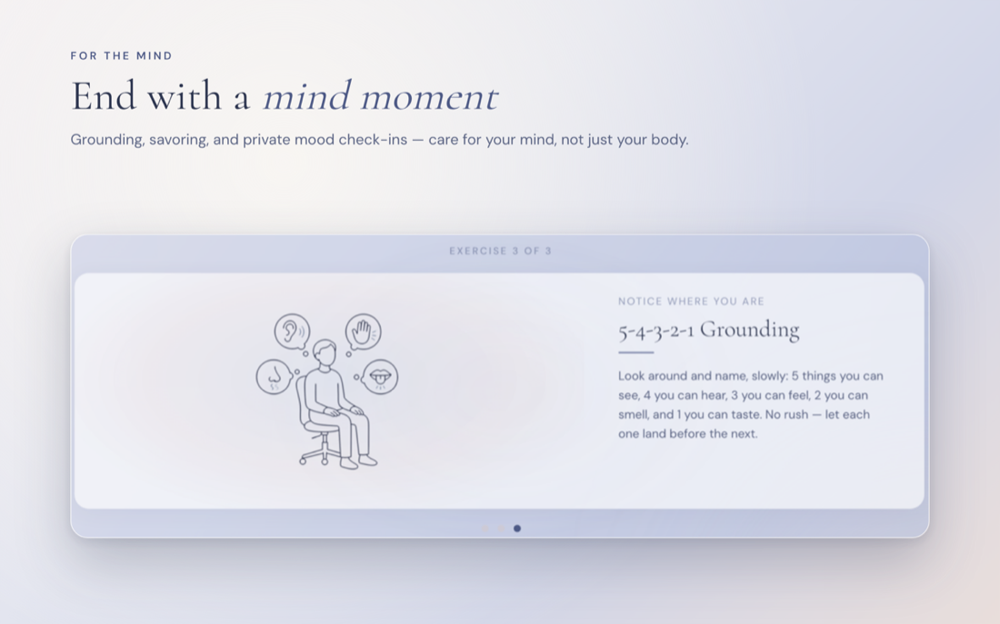
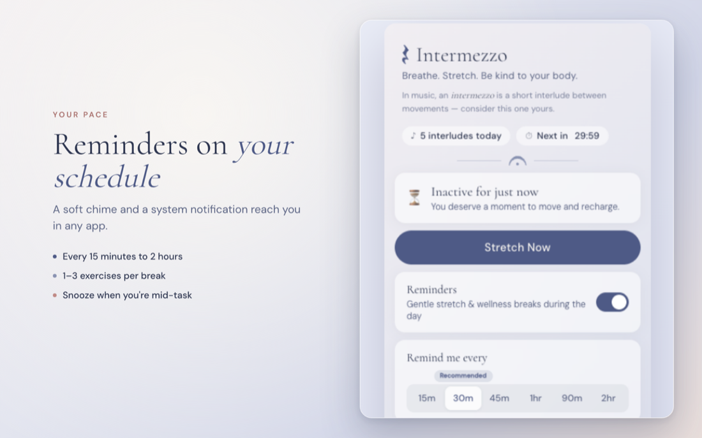

<p align="center">
  
</p>

<h1 align="center">Intermezzo</h1>

<p align="center">
  <em>Breathe. Stretch. Be kind to your body and mind.</em>
</p>

<p align="center">
  A Chrome extension that gives you gentle reminders to take short wellness breaks — stretch, fix your posture, and check in with your mind — throughout your workday. Because you weren't built to sit hunched at a screen for 8 hours straight.
</p>


<p align="center">
  <a href="https://chromewebstore.google.com/detail/intermezzo/djlmhgokdfglhcdelkgljakecafpjbpj"></a>
  <a href="https://chromewebstore.google.com/detail/intermezzo/djlmhgokdfglhcdelkgljakecafpjbpj"></a>
  
  
</p>

<p align="center">
  <a href="https://chromewebstore.google.com/detail/intermezzo/djlmhgokdfglhcdelkgljakecafpjbpj"><strong>➕ Add to Chrome</strong></a>
  &nbsp;·&nbsp;
  <a href="https://intermezzo.care"><strong>intermezzo.care</strong></a>
</p>

<p align="center">
  <a href="https://chromewebstore.google.com/detail/intermezzo/djlmhgokdfglhcdelkgljakecafpjbpj"></a>
</p>

---

## Why Intermezzo?

In music, an **intermezzo** is a short, light interlude played between the main movements of an opera or symphony — a graceful pause that lets everyone breathe before the next movement begins. This extension is that pause for your workday: a brief, restorative interlude between long stretches of focused work. (It's also why the brand mark is a **quarter rest** — the score's own symbol for "rest here" — and why the dividers are **fermatas**, the "hold this moment" mark.)

We've all been there — hours deep in a coding session, shoulders creeping up to your ears, back slowly curling into a question mark. By the time you notice, your neck is stiff and your hips are screaming.

Intermezzo nudges you at regular intervals with a short, guided wellness break. Each break is tailored to the time of day and what your body actually needs, not just a random reminder to "take a break."

## What it does

- **Smart stretch selection** — picks 1-3 stretches per break, mixing different body areas and adapting to the time of day. Morning breaks ease you in, afternoon breaks target the tension that's built up.
- **50+ stretches** — covering neck, shoulders, spine, lower back, chest, hips, legs, wrists, and eye-rest breaks for screen strain. Each one written like a friend is coaching you through it.
- **Mind moments** — some breaks end with an optional, on-device check-in for your mind: a gentle grounding prompt, a moment to savor something good, or a one-tap mood note. Care for your mind, not just your body.
- **Reaches you in any app** — a system notification and a soft chime fire even when Chrome is in the background, so the nudge lands whether you're in Figma, a fullscreen video, or a game — not just when you're looking at the browser.
- **Snooze** — mid-task? Snooze the reminder for a few minutes and pick it back up when you're ready.
- **Built-in timer** — with per-side countdowns for stretches that need them. Just hit "Begin" and follow along.
- **SVG illustrations** — every stretch has an illustrated stick-figure guide.
- **Configurable intervals** — remind you anywhere from every 15 minutes to every 2 hours. You're in control.
- **Streak tracking** — see how many interludes you've completed today.
- **Motivational finish** — a little confetti and a kind word when you complete your stretches. You earned it.

## A look inside

<table>
  <tr>
    <td width="50%"></td>
    <td width="50%"></td>
  </tr>
  <tr>
    <td align="center"><em>Short, guided stretch breaks — per-side timers, clear instructions, video demos</em></td>
    <td align="center"><em>End with a mind moment — grounding, savoring, or a private mood check-in</em></td>
  </tr>
</table>

<p align="center">
  
  <br />
  <em>Reminders on your schedule — every 15 minutes to every 2 hours, snooze when you're mid-task</em>
</p>

## Install

### From the Chrome Web Store (recommended)

One click, auto-updates included:

**[➕ Add Intermezzo to Chrome](https://chromewebstore.google.com/detail/intermezzo/djlmhgokdfglhcdelkgljakecafpjbpj)**

### From source (for tinkering)

1. Clone this repo
   ```
   git clone https://github.com/annaPerdomo/intermezzo-extension.git
   ```
2. Open `chrome://extensions` in Chrome
3. Enable **Developer mode** (top right toggle)
4. Click **Load unpacked**
5. Select the `intermezzo-extension` folder

That's it. Intermezzo will appear in your toolbar.

## How it works

Click the extension icon to open the popup. From there you can:

- **Toggle reminders** on or off
- **Set your interval** — how often you want to be reminded
- **Stretch Now** — skip the wait and start a break immediately
- **See your history** — which stretches you've done today

When a reminder fires, you get a gentle system notification and a chime. Click it (or its **Stretch now** button) to open the guided break, or hit **Snooze** to be reminded again in a few minutes. Prefer the break to open on its own? Turn off **Notify before opening** in the popup and the break tab opens immediately instead.

Each exercise has a description, a visual, and a countdown timer. Navigate between exercises, skip if you need to, or follow the whole routine.

## Publishing

Intermezzo is live on the [Chrome Web Store](https://chromewebstore.google.com/detail/intermezzo/djlmhgokdfglhcdelkgljakecafpjbpj). See [STORE.md](STORE.md) for the publishing guide used to get it there — listing copy, permission justifications, and the packaging script for new releases.

## Design

Intermezzo leans into its musical namesake. The palette is **Nocturne** — dusky blue-greys (olive-brown, sage-brown, moss-blue) warmed by a touch of terracotta and soft cream — set on frosted glass cards over a background that gently *breathes* at a calming ~11-second cycle. The brand mark is a **quarter rest** (the score's symbol for "rest here"), section dividers are **fermatas** (the "hold this moment" mark), and the completion screen is scattered with faint music glyphs. Even the chime is a warm, bowed **cello** swell rather than a notification beep. Every detail is meant to feel like a quiet interlude, not another alert demanding your attention.

---

<p align="center">
  <em>Take care of yourself. You deserve it.</em>
</p>
